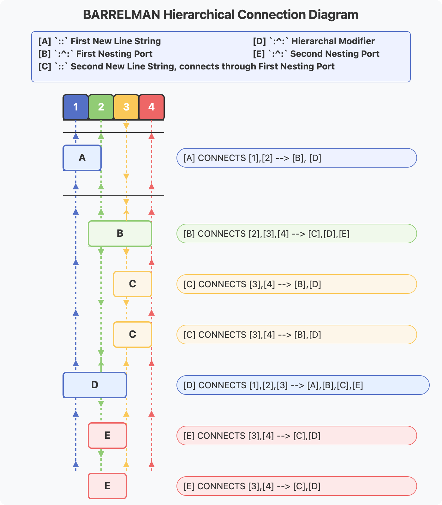
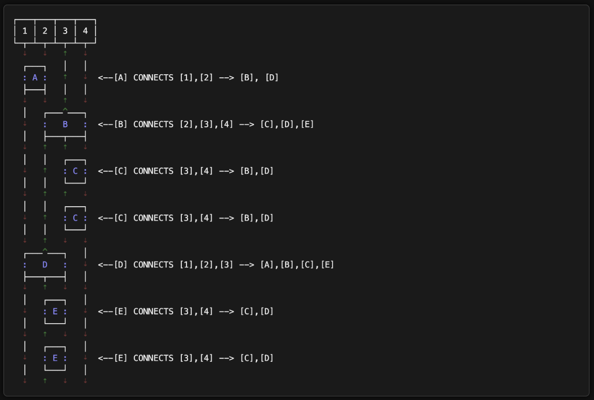

# BARRELMAN Syntax Documentation

## Overview

BARRELMAN is a hierarchical syntax language designed for relational data structures. This README documents the syntax structure, rules, and practical usage examples.

## Syntax Line Zones

```
┌─────┐                  ┌─────┐               ┌─────┐               ┌─────┐
│ [1] │                  │ [2] │               │ [3] │               │ [4] │
├─────┴──────────────────┼─────┴───────────────┼─────┴───────────────┼─────┴─────────────┐
│  [1.1] DECLARATION     │  [2.1] CAUSE        │  [3.1] EFFECT       │  [4.1] OUTCOME    │
├────────────────────────┼─────────────────────┼─────────────────────┼───────────────────┤
│  [1.2] KEYWORD         │  [2.2] FUNCTION     │  [3.2] PARAMATER    │                   │
├────────────────────────┼─────────────────────┼─────────────────────┼───────────────────┤
│  [1.3] RELATION        │  [2.3] MODIFIER     │  [3.3] TRIGGER      │                   │
├────────────────────────┼─────────────────────┼─────────────────────┼───────────────────┤
│  [1.4] NEW LINE        │                     │                     │                   │
├┬┬┬┬┬┬┬┬┬┬┬┬┬┬┬┬┬┬┬┬┬┬┬┬┼┬┬┬┬┬┬┬┬┬┬┬┬┬┬┬┬┬┬┬┬┬┼┬┬┬┬┬┬┬┬┬┬┬┬┬┬┬┬┬┬┬┬┬┼┬┬┬┬┬┬┬┬┬┬┬┬┬┬┬┬┬┬┬┤
│                                                                                        │
│             [1.3]                                                                      │
│               ^                                                                        │
│         [1.2] │             [2.3]         [3.3]                                        │
│           ^   │               ^             ^                                          │
│     [1.1] │   │       [2.2]   │      [3.2]  │                                          │
│       ^   │   │         ^     │        ^    │                    [4.1]                 │
│ [1.4] │   │   │   [2.1] │     │  [3.1] │    │                      ^                   │
│   ^   │   │   │     ^   │     │    ^   │    │                      │                   │
│ ┌─┼───┴───┼───┼─┐ ┌─┴───┼─────┼─┐ ┌┴───┼────┼─┐ ┌──────────────────┴─────────────────┐ │
│ │ +       +   + │ │     +     + │ │    +    + │ │                                    │ │
│ │ :: RACE[2] // │ │ AWAKENING % │ │ DENIED -> │ │       PLANETARY SYSTEM FAILURE     │ │
├─┴───────────────┴─┴─────────────┴─┴───────────┴─┴────────────────────────────────────┴─┤
│                                                                                        │
│     :: RACE[2] // AWAKENING % DENIED -> PLANETARY SYSTEM FAILURE [SELF-INITIATED]      │
│                                                                                        │
└────────────────────────────────────────────────────────────────────────────────────────┘
```

## Core Symbols and Functions

| Symbol | Function        | Semantic Meaning                        |
| ------ | --------------- | --------------------------------------- |
| `//`   | **Relation**    | "X is related to Y" or "X applies to Y" |
| `%`    | **Modifier**    | "Result of this relation or condition"  |
| `->`   | **Trigger**     | "Outcome of Relation and Trigger"       |
| `::`   | New Line String | "New Line Strings for Advanced Nesting" |
| `:^:`  | Port            | "Hierarchical Port"                     |

## BARRELMAN Core Concepts

- `::` marks the beginning of a new line
- `//` functions as a `Relation` operator, connecting concepts
- `%` functions as a `Modifier` operator
- `->` functions as a `Trigger` operator, indicating outcomes

### Basic Syntax Example

```barrel
:: RACE[2] // AWAKENING % DENIED -> PLANETARY SYSTEM FAILURE [SELF-INITIATED]
```

This means:

- Race 2, in Relation to AWAKENING, has Modifier: DENIED, which Triggered PLANETARY SYSTEM FAILURE [SELF-INITIATED]

## Hierarchical Nesting Structure



### Hierarchical Nesting Port (`:^:`)

The Hierarchical Nesting Port is a vertical operator `^` inserted into a New Call String to reference keywords from above lines.

### Nesting Rules

1. **When using `:^:` (Hierarchical Nesting Port)**:

   - Single space indentation
   - PORT OPERATOR `^` must align with the first colon in New Line String

2. **When using only `::` (New Line String)**:
   - Double space indentation

### Examples of Correct Nesting

```barrel
:: INTELLIGENCE // EARTH NOT RARE % HUMAN RARE
 :^: EARTH // 1 OF 302,973 % BIRTH CONSCIOUS LIFEFORM
  :: EARTH // 1 OF 1 % ESCAPE PLANETARY SILENCE
```

```barrel
:: INTELLIGENCE // EARTH NOT RARE % HUMAN RARE
  :: EARTH // 1 OF 302,973 % BIRTH CONSCIOUS LIFEFORM
  :: EARTH // 1 OF 1 % ESCAPE PLANETARY SILENCE
```

### Examples of Incorrect Nesting

```barrel
:: INTELLIGENCE // EARTH NOT RARE % HUMAN RARE
  :^: EARTH // 1 OF 302,973 % BIRTH CONSCIOUS LIFEFORM    # ERROR: Too many spaces before `:^:`
    :: EARTH // 1 OF 1 % ESCAPE PLANETARY SILENCE         # ERROR: Too many spaces
```

```barrel
:: INTELLIGENCE // EARTH NOT RARE % HUMAN RARE
 :: EARTH // 1 OF 302,973 % BIRTH CONSCIOUS LIFEFORM      # ERROR: Single space without `:^:`
 :: EARTH // 1 OF 1 % ESCAPE PLANETARY SILENCE            # ERROR: Single space without `:^:`
```



## Practical Usage Example

```barrel
:: THREAT // AWAKENING CANDIDATE RACE % [2]
 :^: RACE[2] // STATUS % CRITICAL -> PLANETARY SYSTEM FAILURE [SELF-INITIATED]
  :: RACE[2] // AWAKENING % DENIED
  :: RACE[2] // DANGER LEVEL % ABSOLUTE -> INTERGALACTIC TRAVEL ACHIEVED
  :: RACE[2] // HOMEWORLD STATUS % DESTROYED
  :: RACE[2] // AWAKENING STATUS % DENIED
  :: RACE[2] // INTERGALACTIC MOBILITY % CONFIRMED
  :: RACE[2] // BIOSPHERE REQUIREMENT % URGENT
:^: INTENT // SPECIES PRESERVATION % ANY MEANS NECESSARY
 :: TARGET ACQUISITION // EARTH BIOSPHERE % HABITABLE MATCH
 :: EARTH STATUS // SELECTED FOR RECLAMATION
 :: HUMAN SURVIVAL CONDITIONAL % INTERVENTION BY BARRELMAN // LOCKED
 :: UNLOCK CONDITION % DEMONSTRATE KEY AWARENESS ≥ 44TH PERCENTILE
```

## Syntax Zone Details

### Zone 1: Declaration

- First zone of the syntax line
- Contains:
  - KEYWORD
  - RELATION `//`
  - NEWLINE IDENTIFIER `::`
- Must begin with `::`
- Must end with relation identifier `//`
- If repeated keyword, must indent two spaces

### Zone 2: Cause

- Second zone of the syntax line
- Contains:
  - FUNCTION
  - MODIFIER `%`

### Zone 3: Effect

- Third zone of the syntax line
- Contains:
  - PARAMETER
  - TRIGGER `->`

### Zone 4: Outcome

- Final zone containing the result or outcome

## Further Resources

For more complex examples and advanced usage, refer to the complete documentation.

# BARRELMAN Tools

A comprehensive toolset for processing BARRELMAN syntax files.

## Features

- Syntax validation and linting
- Multiple export formats (HTML, Markdown, Graphviz DOT)
- Live preview server with syntax highlighting
- Command-line interface for all operations

## Installation

### Development Installation

```bash
# Install in development mode with all dev tools
pip install -e ".[dev]"
```

### Regular Installation

```bash
pip install -e .
```

## Usage

Once installed, the following commands are available:

```bash
# Process a BARRELMAN file
barrelman example.bman --html --markdown --dot --preview

# Lint a BARRELMAN file
bmanlint example.bman

# Format a BARRELMAN file
bmanfmt example.bman
```

## Development

This project uses several development tools configured in pyproject.toml:

- **Black**: Code formatting

  ```bash
  black src/
  ```

- **isort**: Import sorting

  ```bash
  isort src/
  ```

- **Flake8**: Code linting

  ```bash
  flake8 src/
  ```

- **mypy**: Static type checking

  ```bash
  mypy src/
  ```

- **pytest**: Testing
  ```bash
  pytest
  ```

## Project Structure

- `src/`: Core source code
- `src/exporters/`: Output format generators
- `src/static/`: Static assets (CSS, etc.) for preview server
- `src/github_actions/`: Linting and formatting tools
