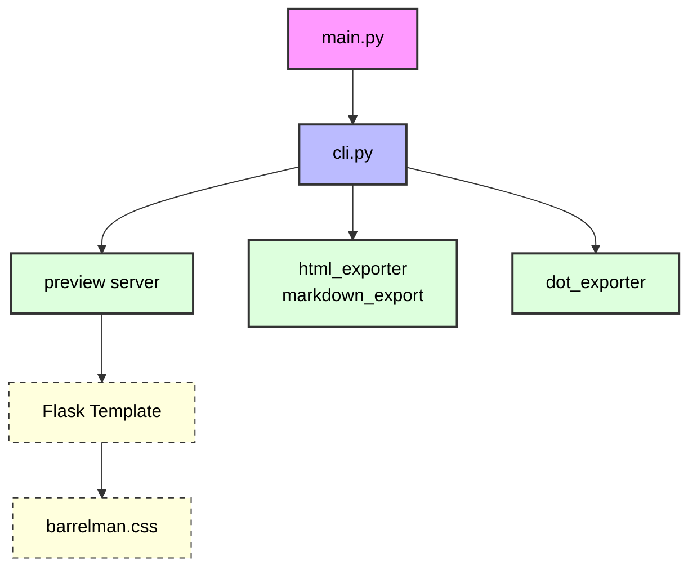

⸻

BARRELMAN SYNTAX PROCESSING SYSTEM ARCHITECTURE

Project Structure

```
/Users/deadcoast/_coding_/python/BARRELMAN/src
├── exporters/
│   ├── graphviz/
│   │   ├── __init__.py
│   │   └── dot_exporter.py
│   ├── test_early_html_exporter/
│   │   ├── __init__.py
│   │   ├── test_early__dark_mode_html.py
│   │   └── test_early_export_html.py
│   ├── test_early_markdown_exporter/
│   │   ├── __init__.py
│   │   └── test_early_export_markdown.py
│   ├── __init__.py
│   ├── html_exporter.py
│   └── markdown_exporter.py
├── static/
│   └── barrelman.css
├── test_early_cli/
│   ├── __init__.py
│   └── test_early_run_cli.py
├── test_early_lexer/
│   ├── __init__.py
│   ├── test_early___init__.py
│   ├── test_early_get_indent_level.py
│   ├── test_early_highlight.py
│   ├── test_early_render_syntax_tree.py
│   ├── test_early_tokenize.py
│   └── test_early_validate_spacing_.py
├── test_early_preview_server/
│   ├── __init__.py
│   └── test_early_run_preview_server.py
├── __init__.py
├── barrelman.bman
├── cli.py
├── lexer.py
├── main.py
├── preview_server.py
└── tree.py
```

⸻

COMPONENT OVERVIEW

main.py – Entry Point
• Responsibility: Delegates execution to cli.run_cli()
• Behavior: Minimal, clean entry script

```python
from cli import run_cli

if __name__ == "__main__":
    run_cli()
```

⸻

cli.py – Command Interface Layer
• Responsibility: Handles all CLI arguments, centralizes BarrelmanLexer parsing.
• Exports parsed tokens to:
• html_exporter
• markdown_exporter
• dot_exporter
• preview_server
• Ensures no duplicate parsing happens downstream.

⸻

lexer.py – Tokenization Core
• Defines: BarrelmanLexer
• Functionality:
• Validates syntax (::, :^:, //, %, ->, spacing)
• Splits lines into token objects (BarrelmanToken)
• Provides hierarchy depth (indent_level)
• Calculates zone_4_outcome logic (e.g. inferred actions)

⸻

preview_server.py – Live HTML Server
• Framework: Flask
• Responsibility: Receives tokens, renders them via Jinja and barrelman.css
• Output: Real-time syntax highlighting at http://localhost:5000
• Includes:
• TEMPLATE using exact spacing logic
• Static route for barrelman.css
• Entry-level <pre> block for preserving visual indentation

⸻

Exporters

html_exporter.py
• Input: tokens, dark_mode toggle
• Output: barrelman_syntax.html
• Custom HTML with inline classes: declaration, modifier, trigger, etc.

⸻

markdown_exporter.py
• Output: Fenced ```barrelman block with raw syntax
• No color, just formatting (for Obsidian/GitHub Markdown compatibility)

⸻

dot_exporter.py
• Output: barrelman_tree.dot for use with Graphviz
• Color-coded nodes depending on nesting_port
• Includes: Label blocks for zone_2, zone_3, zone_4

⸻

barrelman.css – Styling Layer
• Mode Support: .dark and .light body classes
• Visual Mappings:
• .declaration → magenta
• .modifier → green
• .trigger → orange
• .relation → teal
• .port, .entry = structural rendering

⸻



⸻

Design Principles
• Single Source of Truth: cli.py owns the parsing lifecycle
• Functional Separation: Exporters only format, not parse
• Strict Syntax Enforcement: via lexer.py token validator
• Live Debug Output: via preview_server using live Flask + CSS
• Graph-ready output: supports .dot format for static analysis

⸻

Would you like:
• A visual PNG/Graphviz version of the architecture?
• A README.md auto-generated for repo publishing?
• A setup.py to turn this into a pip-installable CLI tool?
